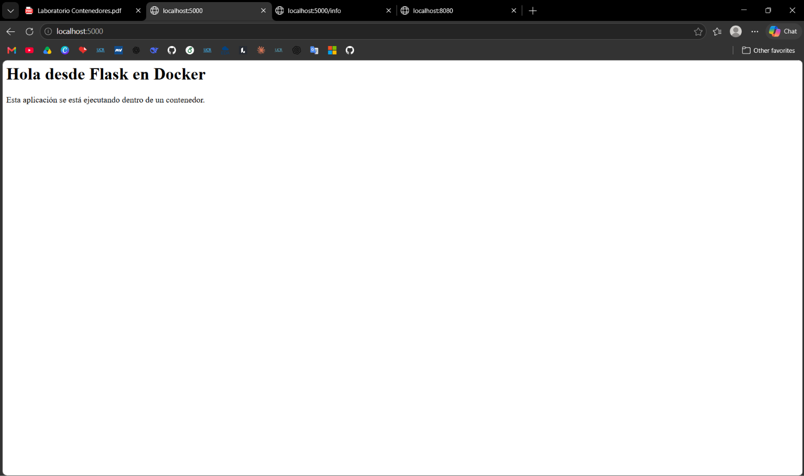
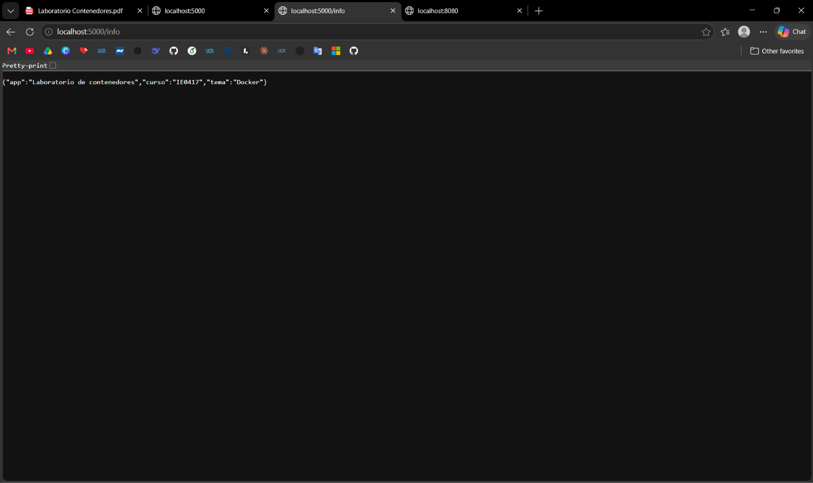
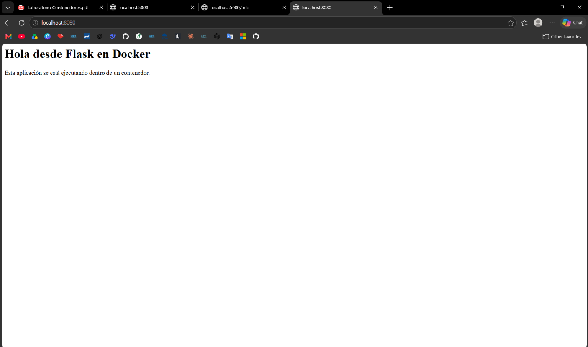
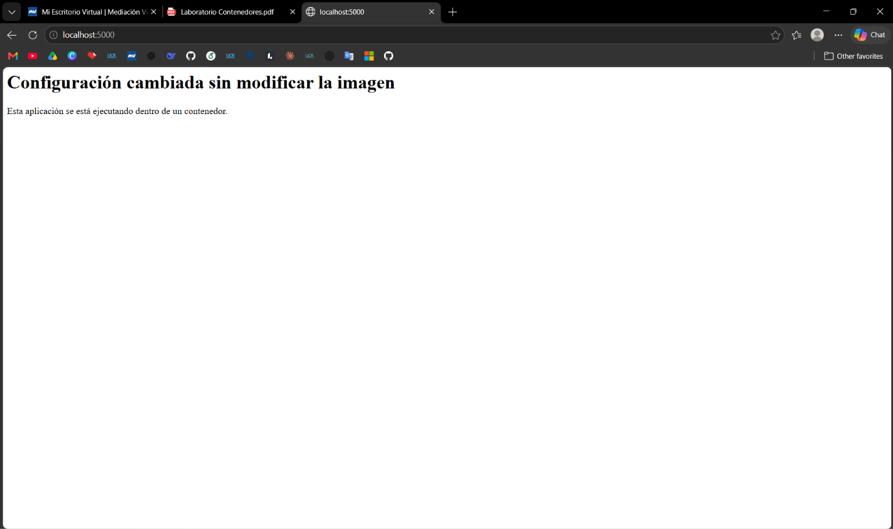

# Parte 7: Publicación de puertos

## Qué se hizo

Se ejecutó la imagen `laboratorio-flask:1.0` publicando el puerto de la aplicación primero como `5000:5000` y luego como `8080:5000`. En ambos casos se accedió a la aplicación desde el navegador usando `localhost`, y al terminar se detuvo y se eliminó cada contenedor.

## Comandos ejecutados

| Comando | Para qué sirve |
|---|---|
| `docker run --name app-puertos -p 5000:5000 laboratorio-flask:1.0` | Crea e inicia un contenedor y publica el puerto 5000 del host hacia el puerto 5000 del contenedor. |
| `docker run --name app-puertos-2 -p 8080:5000 laboratorio-flask:1.0` | Igual que el anterior, pero publica el puerto 8080 del host hacia el puerto 5000 del contenedor. |
| `docker stop` / `docker rm` | Detienen y eliminan el contenedor. |

## Resultado obtenido

### Primer contenedor: `-p 5000:5000`

```text
$ docker run --name app-puertos -p 5000:5000 laboratorio-flask:1.0
 * Serving Flask app 'app'
 * Debug mode: off
WARNING: This is a development server. Do not use it in a production deployment. Use a production WSGI server instead.
 * Running on all addresses (0.0.0.0)
 * Running on http://127.0.0.1:5000
 * Running on http://172.17.0.2:5000
Press CTRL+C to quit
172.17.0.1 - - [06/Oct/2026 01:13:38] "GET / HTTP/1.1" 200 -
172.17.0.1 - - [06/Oct/2026 01:13:38] "GET /favicon.ico HTTP/1.1" 404 -
172.17.0.1 - - [06/Oct/2026 01:14:19] "GET /info HTTP/1.1" 200 -
```

Se abrió `http://localhost:5000` en el navegador y la aplicación respondió con su página principal (como no se definió la variable `MENSAJE`, muestra el mensaje por defecto). Luego se visitó `http://localhost:5000/info`, que devolvió:

```json
{"app":"Laboratorio de contenedores","curso":"IE0417","tema":"Docker"}
```

El registro del contenedor confirma ambas solicitudes: `GET /` y `GET /info` con código `200`. La solicitud a `/favicon.ico` devolvió `404` porque la aplicación no define esa ruta; el navegador la pide automáticamente.

**Captura del navegador (`http://localhost:5000`):**



**Captura del navegador (`http://localhost:5000/info`):**



```text
$ docker stop app-puertos
app-puertos
$ docker rm app-puertos
app-puertos
```

### Segundo contenedor: `-p 8080:5000`

```text
$ docker run --name app-puertos-2 -p 8080:5000 laboratorio-flask:1.0
 * Serving Flask app 'app'
 * Debug mode: off
WARNING: This is a development server. Do not use it in a production deployment. Use a production WSGI server instead.
 * Running on all addresses (0.0.0.0)
 * Running on http://127.0.0.1:5000
 * Running on http://172.17.0.2:5000
Press CTRL+C to quit
172.17.0.1 - - [06/Oct/2026 01:15:45] "GET / HTTP/1.1" 200 -
172.17.0.1 - - [06/Oct/2026 01:15:45] "GET /favicon.ico HTTP/1.1" 404 -
```

Se abrió `http://localhost:8080` y se mostró la misma aplicación que en el caso anterior.

**Captura del navegador (`http://localhost:8080`):**



```text
$ docker stop app-puertos-2
app-puertos-2
$ docker rm app-puertos-2
app-puertos-2
```

## Qué significa `-p 5000:5000`

La opción `-p` (`--publish`) publica un puerto del contenedor en el host, con el formato `-p PUERTO_HOST:PUERTO_CONTENEDOR` [1]. Con `-p 5000:5000`, Docker reenvía el tráfico que llega al puerto 5000 del host hacia el puerto 5000 del contenedor. Por eso se puede acceder a la aplicación en `http://localhost:5000`.

## Qué significa `-p 8080:5000`

Significa que el tráfico que llega al puerto **8080 del host** se reenvía al puerto **5000 del contenedor** [1]. La aplicación sigue escuchando en el puerto 5000 dentro del contenedor, pero desde el host se accede por el 8080, en `http://localhost:8080`.

## Cuál puerto pertenece al host y cuál al contenedor

El número de la **izquierda** de los dos puntos es el puerto del host y el de la **derecha** es el puerto del contenedor [1].

| Opción | Puerto del host | Puerto del contenedor | URL en el navegador |
|---|---|---|---|
| `-p 5000:5000` | 5000 | 5000 | `http://localhost:5000` |
| `-p 8080:5000` | 8080 | 5000 | `http://localhost:8080` |

## Observaciones

- **El puerto interno no cambió:** en ambos casos Flask reportó `Running on http://172.17.0.2:5000`, es decir, la aplicación siempre escuchó en el puerto 5000 dentro del contenedor. Lo único que cambió fue el puerto por el que se accede desde el host. Esto muestra que la aplicación no necesita modificarse para cambiar el puerto publicado.
- **Diferencia con la Parte 6:** en la Parte 6 el contenedor se ejecutó sin `-p`, y `docker ps` mostraba solo `5000/tcp`, sin asignación al host. Ahora, con `-p`, la aplicación sí fue accesible desde el navegador. Esto es consistente con que `EXPOSE` solo documenta el puerto y no lo publica [4].
- **Detención de los contenedores:** como el contenedor se ejecutó en primer plano, ocupaba la terminal, por lo que se interrumpió con `Ctrl+C` antes de ejecutar `docker stop` y `docker rm`. Por eso en la terminal original los comandos aparecen mezclados con el texto del `Ctrl+C`; arriba los dejé limpios. Una alternativa es ejecutar `docker stop` desde otra terminal, como en la Parte 6.
- **Qué no se probó:** no se capturó `docker ps` con el contenedor activo, que habría mostrado la asignación de puertos en la columna `PORTS`, ni se probó iniciar dos contenedores con el mismo puerto del host (ver pregunta 4).

## Preguntas de reflexión

### 1. ¿Por qué no basta con que la aplicación escuche en el puerto 5000 dentro del contenedor?

Porque cada contenedor tiene su propio entorno de red aislado, creado por Docker mediante *namespaces* [2]. Un puerto abierto dentro del contenedor no es visible automáticamente desde el host, ni siquiera con `EXPOSE`, que solo documenta el puerto [4]. Para acceder desde el host, Docker debe reenviar explícitamente el tráfico de un puerto del host al del contenedor, lo cual se hace publicando el puerto con `-p` [1]. Esto se comprobó en el laboratorio: en la Parte 6 la aplicación escuchaba en el puerto 5000 del contenedor, pero no era accesible desde el host, y en esta parte, al agregar `-p`, sí lo fue.

### 2. ¿Qué función cumple el mapeo de puertos?

Conecta un puerto del host con un puerto del contenedor: Docker reenvía el tráfico que llega al puerto del host hacia el puerto indicado dentro del contenedor [1]. Esto permite acceder desde el exterior a un servicio que corre en un entorno aislado, y también elegir en qué puerto del host se ofrece el servicio sin modificar la aplicación, como se hizo con `8080:5000`.

Según la documentación, si no se indica una dirección IP, el puerto queda publicado en todas las direcciones del host, y publicar puertos es inseguro por defecto, para que solo el propio host pueda acceder, se puede incluir la dirección `127.0.0.1` en la opción `-p` (por ejemplo, `-p 127.0.0.1:5000:5000`) [1].

### 3. ¿Cuál es la diferencia entre el puerto del host y el puerto del contenedor?

El puerto del host es el que se abre en la máquina anfitriona y se usa para acceder desde afuera (en el navegador, `localhost:8080`). El puerto del contenedor es el puerto en el que escucha la aplicación dentro del contenedor, dentro de su red aislada [1], [2]. Pueden ser iguales o distintos: con `-p 5000:5000` coinciden y con `-p 8080:5000` no. El puerto del host debe estar libre en la máquina, mientras que el del contenedor depende de la aplicación, que en este caso está configurada en `app.py` para escuchar en el 5000.

### 4. ¿Qué pasaría si dos contenedores intentan usar el mismo puerto del host?

El segundo contenedor no podría iniciarse, porque el puerto del host ya está reservado por el primero. Docker reporta un error como `Bind for 0.0.0.0:<puerto> failed: port is already allocated` [5]. La solución es publicar cada contenedor en un puerto del host distinto, por ejemplo `-p 5000:5000` y `-p 8080:5000`, manteniendo el mismo puerto interno. Esto es posible porque cada contenedor tiene su propia red aislada [2], por lo que ambos pueden usar el puerto 5000 internamente sin conflicto.

En este laboratorio los contenedores se ejecutaron uno después del otro (se eliminó el primero antes de iniciar el segundo), así que este error no se llegó a provocar.

## Reflexión personal

Con esta parte entendí por qué la aplicación no era accesible en la Parte 6 aunque estuviera funcionando: el contenedor tiene su propia red y hay que decirle a Docker qué puerto del host debe conectarse con cuál del contenedor. También me pareció útil ver que el puerto de la aplicación puede quedarse fijo en 5000 y que, con `-p`, es solo la configuración de `docker run` la que decide por dónde se accede desde afuera. Esto permite ejecutar varias copias de la misma aplicación a la vez usando puertos distintos del host.

## Logs e inspeccion

### Qué se hizo

Se ejecutó el contenedor `app-logs` en segundo plano con el puerto 5000 publicado, se revisaron sus logs (estáticos y en tiempo real), se generaron solicitudes desde el navegador, se inspeccionó el contenedor y se revisó su consumo de recursos. Al final se detuvo y se eliminó.

### Comandos ejecutados

| Comando | Para qué sirve |
|---|---|
| `docker run -d --name app-logs -p 5000:5000 laboratorio-flask:1.0` | Crea e inicia el contenedor en segundo plano (`-d`); en lugar de mostrar la salida de la aplicación, imprime el ID del contenedor. |
| `docker logs app-logs` | Muestra los logs del contenedor generados hasta ese momento. |
| `docker logs -f app-logs` | Muestra los logs y sigue mostrando los nuevos en tiempo real. |
| `docker inspect app-logs` | Muestra información detallada del contenedor en formato JSON. |
| `docker stats` | Muestra el consumo de recursos de los contenedores en ejecución. |
| `docker stop app-logs` / `docker rm app-logs` | Detienen y eliminan el contenedor. |

### Resultado obtenido

**Ejecución en segundo plano:**

```text
$ docker run -d --name app-logs -p 5000:5000 laboratorio-flask:1.0
821e683a6c8b145c60eecde5e679facdd964929f78c3795810d0b3bd80bf2e25
```

**Logs del contenedor** (todavía sin solicitudes):

```text
$ docker logs app-logs
 * Serving Flask app 'app'
 * Debug mode: off
WARNING: This is a development server. Do not use it in a production deployment. Use a production WSGI server instead.
 * Running on all addresses (0.0.0.0)
 * Running on http://127.0.0.1:5000
 * Running on http://172.17.0.2:5000
Press CTRL+C to quit
```

**Logs en tiempo real**, después de visitar `http://localhost:5000` y `http://localhost:5000/info` en el navegador:

```text
$ docker logs -f app-logs
 * Serving Flask app 'app'
 * Debug mode: off
WARNING: This is a development server. Do not use it in a production deployment. Use a production WSGI server instead.
 * Running on all addresses (0.0.0.0)
 * Running on http://127.0.0.1:5000
 * Running on http://172.17.0.2:5000
Press CTRL+C to quit
172.17.0.1 - - [06/Oct/2026 16:34:54] "GET / HTTP/1.1" 200 -
172.17.0.1 - - [06/Oct/2026 16:34:54] "GET /favicon.ico HTTP/1.1" 404 -
172.17.0.1 - - [06/Oct/2026 16:38:28] "GET /info HTTP/1.1" 200 -
```

**Inspección con el contenedor en ejecución** (extracto; se omiten los campos que no se discuten aquí):

```text
$ docker inspect app-logs
[
    {
        "Id": "821e683a6c8b145c60eecde5e679facdd964929f78c3795810d0b3bd80bf2e25",
        "Created": "2026-10-06T16:33:09.624596512Z",
        "Path": "python",
        "Args": ["app.py"],
        "State": {
            "Status": "running",
            "Running": true,
            "Pid": 10871,
            "ExitCode": 0,
            "StartedAt": "2026-10-06T16:33:09.719245202Z",
            "FinishedAt": "0001-01-01T00:00:00Z"
        },
        "Image": "sha256:b1b6522d36f1db37a17c50a13790b1bab4d5330938c5dd498f9a3f2458688bcd",
        "LogPath": "/var/lib/docker/containers/821e683a6c8b.../821e683a6c8b...-json.log",
        "Name": "/app-logs",
        "RestartCount": 0,
        "HostConfig": {
            "LogConfig": { "Type": "json-file", "Config": {} },
            "NetworkMode": "bridge",
            "PortBindings": {
                "5000/tcp": [ { "HostIp": "", "HostPort": "5000" } ]
            },
            "RestartPolicy": { "Name": "no", "MaximumRetryCount": 0 },
            "Memory": 0,
            "NanoCpus": 0,
            ...
        },
        "Config": {
            "Hostname": "821e683a6c8b",
            "ExposedPorts": { "5000/tcp": {} },
            "Env": [
                "PATH=/usr/local/bin:/usr/local/sbin:/usr/local/bin:/usr/sbin:/usr/bin:/sbin:/bin",
                "LANG=C.UTF-8",
                "PYTHON_VERSION=3.11.17",
                ...
            ],
            "Cmd": ["python", "app.py"],
            "Image": "laboratorio-flask:1.0",
            "WorkingDir": "/app",
            ...
        },
        "NetworkSettings": {
            "SandboxID": "9732af231647cf7e3dfe2b01416b18cac0556be2e0d0bc81f3240610403cae5b",
            "SandboxKey": "/var/run/docker/netns/9732af231647",
            "Ports": { "5000/tcp": [ ... ] },
            ...
        },
        ...
    }
]
```

**Inspección después de detener el contenedor** (extracto; se muestran solo los campos que cambiaron):

```text
$ docker inspect app-logs
...
        "State": {
            "Status": "exited",
            "Running": false,
            "Pid": 0,
            "ExitCode": 137,
            "StartedAt": "2026-10-06T16:33:09.719245202Z",
            "FinishedAt": "2026-10-06T16:39:39.485416627Z"
        },
...
        "NetworkSettings": {
            "SandboxID": "",
            "SandboxKey": "",
            "Ports": {},
            ...
        },
...
```

**Consumo de recursos:**

```text
$ docker stats
CONTAINER ID   NAME       CPU %     MEM USAGE / LIMIT     MEM %     NET I/O           BLOCK I/O        PIDS
821e683a6c8b   app-logs   0.02%     24.83MiB / 7.568GiB   0.32%     7.88kB / 3.92kB   24.8MB / 147kB   3
```

**Detención y eliminación:**

```text
$ docker stop app-logs
app-logs
$ docker rm app-logs
app-logs
```

### Qué muestra `docker logs`

Muestra los logs del contenedor, es decir, lo que el proceso principal escribió en su salida estándar y de error [5]. El comando recupera los logs presentes en el momento de ejecutarse y termina [5]. En este laboratorio, la primera ejecución solo mostró los mensajes de inicio de Flask, porque todavía no se había hecho ninguna solicitud.

### Para qué sirve `docker logs -f`

La opción `-f` (`--follow`) hace que el comando no termine, sino que siga mostrando en tiempo real la nueva salida del contenedor [5]. Con ella se vieron aparecer las solicitudes en el momento en que se hicieron desde el navegador: `GET /` con código `200`, `GET /favicon.ico` con `404` (el navegador la pide automáticamente y la aplicación no la define) y `GET /info` con `200`.

### Qué tipo de información muestra `docker inspect`

Muestra información detallada de bajo nivel sobre un objeto de Docker, en este caso el contenedor, en formato JSON [6]. En la salida de este laboratorio se pueden distinguir estos grupos de información:

| Sección | Qué contiene (ejemplo del laboratorio) |
|---|---|
| `State` | Estado del contenedor: `running` con `Pid` 10871 y `ExitCode` 0; después de detenerlo, `exited` con `ExitCode` 137 y la hora de finalización. |
| `Config` | Configuración con la que se creó: comando `["python", "app.py"]`, directorio de trabajo `/app`, variables de entorno (por ejemplo `PYTHON_VERSION=3.11.17`), puerto expuesto `5000/tcp` e imagen `laboratorio-flask:1.0`. |
| `HostConfig` | Configuración de ejecución: red `bridge`, política de reinicio `no`, publicación de puertos (`5000/tcp` hacia el puerto 5000 del host [1]), límite de memoria `0` (sin límite) y tipo de logs `json-file`. |
| `NetworkSettings` | Información de red; con el contenedor detenido, `Ports` quedó vacío y el identificador de red (`SandboxID`) quedó en blanco. |
| Otros | ID del contenedor, fecha de creación, ID de la imagen y ruta del archivo de logs (`LogPath`). |

Además, la salida se puede filtrar con `--format` para obtener solo un campo [6].

### Qué información muestra `docker stats`

Muestra en vivo el consumo de recursos de los contenedores en ejecución [7]. Las columnas de la salida obtenida significan:

| Columna | Valor obtenido | Significado |
|---|---|---|
| `CPU %` | 0.02% | Porcentaje de CPU que usa el contenedor. |
| `MEM USAGE / LIMIT` | 24.83MiB / 7.568GiB | Memoria que usa el contenedor y memoria total que se le permite usar [7]. |
| `MEM %` | 0.32% | Porcentaje de memoria usada respecto al límite. |
| `NET I/O` | 7.88kB / 3.92kB | Datos que el contenedor ha recibido y enviado por su interfaz de red. |
| `BLOCK I/O` | 24.8MB / 147kB | Datos que el contenedor ha leído y escrito en dispositivos de bloque del host [7]. |
| `PIDS` | 3 | Número de procesos del contenedor [7]. |

El comando muestra los datos de forma continua hasta que se interrumpe con `Ctrl+C`; con la opción `--no-stream` se obtiene una sola lectura [7].

### Observaciones

- **Código de salida 137:** después de detener el contenedor, `docker inspect` mostró `ExitCode` 137. Este valor corresponde a una terminación por la señal `SIGKILL` (señal número 9 [8]; el 137 resulta de sumar 128 más el número de la señal). `docker stop` primero envía `SIGTERM` al proceso principal y, si este no termina tras un período de gracia, envía `SIGKILL` [8]. Una posible explicación es que el proceso de Python no respondió a `SIGTERM` y Docker tuvo que forzar su finalización, pero esto es una hipótesis mía que no comprobé.
- **Límite de memoria:** `docker stats` mostró un límite de 7.568 GiB, que coincide con la memoria total que reportó `docker info` en la Parte 1. Como `docker inspect` muestra `"Memory": 0` (sin límite configurado) y, por defecto, un contenedor no tiene restricciones de recursos y puede usar lo que el kernel del host le permita [9], interpreto que ese límite corresponde a la memoria disponible en el entorno donde corre Docker (WSL2).
- **Terminales:** `docker logs -f` y `docker stats` mantienen ocupada la terminal, por lo que se usaron dos terminales. El segundo `docker inspect` (con estado `exited`) lo ejecuté al terminar el seguimiento de logs, que interpreto que finalizó cuando el contenedor se detuvo desde la otra terminal.
- **Salida de `docker inspect`:** se muestran extractos por extensión; el resto de campos (límites de CPU y memoria, rutas enmascaradas del kernel, entre otros) no se discuten en este informe.

### Preguntas de reflexión

#### 1. ¿Por qué los logs son importantes al trabajar con contenedores?

Porque cuando un contenedor corre en segundo plano su salida no aparece en la terminal, y `docker logs` es la forma de ver lo que el proceso principal imprimió sin entrar al contenedor [5]. Los logs permiten confirmar que la aplicación arrancó bien, ver qué solicitudes recibe y detectar errores. En este laboratorio, los logs confirmaron que las solicitudes del navegador sí llegaron a la aplicación (`GET /` y `GET /info` con `200`).

#### 2. ¿Qué diferencia hay entre ver logs históricos y logs en tiempo real?

Los logs históricos (`docker logs`) son los que el contenedor ya generó en el momento de ejecutar el comando, y el comando termina [5]. Los logs en tiempo real (`docker logs -f`) siguen transmitiendo la nueva salida a medida que se produce [5]. En el laboratorio, la primera consulta solo mostró el arranque de Flask, y con `-f` las solicitudes aparecieron justo cuando se hicieron en el navegador. Ver logs históricos sirve para revisar lo que pasó, y en tiempo real sirve para observar el efecto de una acción mientras se hace.

#### 3. ¿Qué información útil se puede obtener con `docker inspect`?

Se puede obtener el estado del contenedor y su código de salida (por ejemplo, el 137 después de detenerlo), la configuración con la que se creó (comando, directorio de trabajo, variables de entorno), cómo están publicados los puertos, la política de reinicio, la red a la que está conectado y la ubicación del archivo de logs [6]. Es útil para verificar que el contenedor quedó configurado como se esperaba, por ejemplo que el puerto 5000 del contenedor se publicó en el 5000 del host, y para diagnosticar por qué un contenedor terminó. También se puede consultar un solo dato con `--format` [6].

#### 4. ¿Por qué es importante observar el consumo de recursos?

Porque, por defecto, un contenedor no tiene límites y puede usar tantos recursos como el kernel del host le permita [9]. Si una aplicación consume demasiada CPU o memoria, puede afectar al resto de contenedores y al propio equipo. `docker stats` permite ver ese consumo y decidir si hace falta limitarlo, lo cual se configura con opciones de `docker run` como `--memory` o `--cpus` [9]. En este laboratorio, la aplicación usó muy pocos recursos (0.02% de CPU y 24.83 MiB de memoria), lo cual es esperable para una aplicación Flask mínima sin tráfico.

### Reflexión personal

Con esta parte vi que un contenedor en segundo plano no es una caja negra: con `logs`, `inspect` y `stats` se puede saber qué hace, cómo está configurado y cuántos recursos usa sin entrar a él. Me llamó la atención el código de salida 137 después de detenerlo, porque muestra que detener un contenedor no siempre es una terminación limpia. También me sirvió ver cómo `inspect` confirma datos que antes solo asumía, como la publicación del puerto y la ausencia de límites de memoria.


## Variables de entorno

### Qué se hizo

En esta parte se configuró la aplicación mediante una variable de entorno llamada `MENSAJE`. Esto permite modificar el mensaje mostrado por la aplicación al ejecutar el contenedor, sin necesidad de modificar el código fuente ni reconstruir la imagen.

La aplicación obtiene el valor de esta variable mediante `os.environ.get("MENSAJE", "Hola desde Flask en Docker")`. Si la variable está definida, se utiliza su valor; de lo contrario, se utiliza el mensaje predeterminado.

### Comandos ejecutados

| Comando | Propósito |
|---|---|
| `docker run --name app-env -p 5000:5000 -e MENSAJE="Hola desde una variable de entorno" laboratorio-flask:1.0` | Crear y ejecutar un contenedor utilizando la imagen `laboratorio-flask:1.0` y establecer la variable `MENSAJE`. |
| `http://localhost:5000` | Acceder desde el navegador a la aplicación Flask. |
| `docker stop app-env` | Detener el contenedor después de realizar la prueba. |
| `docker rm app-env` | Eliminar el contenedor detenido. |
| `docker run --name app-env-2 -p 5000:5000 -e MENSAJE="Configuración cambiada sin modificar la imagen" laboratorio-flask:1.0` | Crear un segundo contenedor utilizando la misma imagen, pero con un valor diferente para `MENSAJE`. |
| `http://localhost:5000` | Verificar en el navegador el nuevo mensaje configurado. |
| `docker stop app-env-2` | Detener el segundo contenedor. |
| `docker rm app-env-2` | Eliminar el segundo contenedor. |

### Resultado obtenido

#### Primera ejecución

Se ejecutó el contenedor `app-env` utilizando la siguiente variable de entorno:

```bash
-e MENSAJE="Hola desde una variable de entorno"
```

Al acceder a `http://localhost:5000`, la aplicación mostró:

```text
Hola desde una variable de entorno
```

**Captura:** `parte9_localhost_configuracion_sin_modificar_imagen`




#### Segunda ejecución

Después de detener y eliminar el primer contenedor, se volvió a ejecutar la misma imagen, pero utilizando un valor diferente para la variable:

```bash
-e MENSAJE="Configuración cambiada sin modificar la imagen"
```

Al acceder nuevamente a `http://localhost:5000`, la aplicación mostró:

```text
Configuración cambiada sin modificar la imagen
```

**Captura:** `parte9_localhost_hola_desde_variable_entorno`


Estos resultados muestran que una misma imagen de Docker puede ejecutarse con diferentes configuraciones dependiendo de las variables de entorno proporcionadas al momento de crear el contenedor.

### Qué hace la opción `-e`

La opción `-e`, equivalente a `--env`, permite establecer variables de entorno dentro del contenedor al momento de ejecutar `docker run` [10].

En este caso:

```bash
-e MENSAJE="Hola desde una variable de entorno"
```

crea dentro del contenedor una variable llamada `MENSAJE` cuyo valor es `"Hola desde una variable de entorno"`.

La aplicación Flask puede acceder a este valor mediante:

```python
os.environ.get("MENSAJE", "Hola desde Flask en Docker")
```

Por lo tanto, el valor de `MENSAJE` utilizado por la aplicación puede cambiarse desde el comando de ejecución sin modificar el código fuente.

### Qué cambió en la aplicación

El código de la aplicación no fue modificado entre las dos ejecuciones. Lo que cambió fue el valor de la variable de entorno `MENSAJE`.

En la primera ejecución:

```text
MENSAJE = "Hola desde una variable de entorno"
```

En la segunda ejecución:

```text
MENSAJE = "Configuración cambiada sin modificar la imagen"
```

La aplicación utiliza el valor recibido para generar el contenido de la página principal.

### Por qué no fue necesario reconstruir la imagen

No fue necesario reconstruir la imagen porque no se realizaron cambios en el código fuente, el `Dockerfile` ni las dependencias de la aplicación.

La imagen `laboratorio-flask:1.0` se mantuvo igual y únicamente se modificó la configuración proporcionada al crear cada contenedor.

Esto permite utilizar una misma imagen para diferentes configuraciones:

```text
                Imagen
        laboratorio-flask:1.0
                  |
          ┌───────┴───────┐
          |               |
     Contenedor 1    Contenedor 2
          |               |
   MENSAJE = A       MENSAJE = B
          |               |
       Resultado A     Resultado B
```

Esta separación entre la imagen y la configuración de ejecución facilita reutilizar una misma imagen en diferentes entornos o situaciones [10].

### Observaciones

- La opción `-e` permite modificar variables de entorno al ejecutar un contenedor.
- El valor de `MENSAJE` puede cambiar sin modificar el código de la aplicación.
- No fue necesario reconstruir `laboratorio-flask:1.0`, ya que la imagen no cambió.
- Los dos contenedores utilizaron exactamente la misma imagen, pero tuvieron configuraciones diferentes.
- Las variables de entorno son útiles para separar ciertos valores de configuración del código de la aplicación.
- Aunque las variables de entorno permiten evitar colocar directamente algunos valores de configuración en el código fuente, no deben considerarse por sí solas un mecanismo completo para proteger información altamente sensible, como contraseñas o claves secretas.

### Preguntas de reflexión

#### ¿Para qué es útil usar variables de entorno en una aplicación?

Las variables de entorno permiten modificar determinados valores de configuración sin tener que modificar el código fuente o reconstruir la imagen. Esto resulta útil cuando una misma aplicación debe ejecutarse con diferentes configuraciones.

Por ejemplo, una aplicación podría utilizar diferentes direcciones de servidores, puertos, modos de ejecución o mensajes dependiendo del entorno donde se ejecute.

#### ¿Qué tipo de información podría configurarse mediante variables de entorno?

Pueden utilizarse para configurar valores que cambian entre diferentes ejecuciones o entornos, como nombres de servidores, puertos, nombres de bases de datos, modos de ejecución o parámetros de configuración.

También pueden utilizarse para proporcionar credenciales y otros valores sensibles durante la ejecución, aunque para secretos de alta sensibilidad es preferible utilizar mecanismos específicos de gestión de secretos.

#### ¿Por qué no es recomendable colocar contraseñas directamente en el código?

Colocar contraseñas directamente en el código puede hacer que estas queden almacenadas en los archivos fuente y, por ejemplo, terminen en un repositorio de código o dentro de una imagen de Docker.

Separar la configuración del código ayuda a reducir este problema. Sin embargo, las variables de entorno tampoco constituyen por sí mismas un sistema completo de gestión de secretos, por lo que para información altamente sensible deben utilizarse mecanismos diseñados específicamente para proteger secretos.

#### ¿Qué ventaja tiene utilizar la misma imagen con diferentes configuraciones?

Permite reutilizar una misma imagen sin tener que construir una versión diferente para cada configuración. De esta manera, la imagen contiene la aplicación y sus dependencias, mientras que ciertos parámetros pueden establecerse durante la ejecución del contenedor.

En esta práctica se comprobó esto utilizando `laboratorio-flask:1.0` en dos ejecuciones diferentes y cambiando únicamente el valor de `MENSAJE`.

### Reflexión personal

Esta práctica permitió comprobar de manera práctica la separación entre la aplicación contenida en una imagen de Docker y la configuración utilizada durante su ejecución. Al utilizar variables de entorno, fue posible cambiar el comportamiento de la aplicación sin modificar el código fuente ni reconstruir la imagen.

Además, se pudo observar que una misma imagen puede reutilizarse para crear contenedores con configuraciones diferentes. Esto resulta útil para desplegar una aplicación en distintos entornos manteniendo una única imagen y modificando únicamente los parámetros necesarios en cada ejecución.


## Referencias

[1] Docker Inc., "Port publishing and mapping," *Docker Docs*. [En línea]. Disponible en: https://docs.docker.com/engine/network/port-publishing/. [Accedido: 6-oct-2026].

[2] Docker Inc., "Docker Engine security," *Docker Docs*. [En línea]. Disponible en: https://docs.docker.com/engine/security/. [Accedido: 6-oct-2026].

[3] Docker Inc., "Dockerfile reference," *Docker Docs*. [En línea]. Disponible en: https://docs.docker.com/reference/dockerfile/. [Accedido: 6-oct-2026].

[4] Baeldung, "Docker: address already in use error," *Baeldung*. [En línea]. Disponible en: https://www.baeldung.com/linux/docker-address-already-in-use. [Accedido: 6-oct-2026].

[5] Docker Inc., "docker container logs," *Docker Docs*. [En línea]. Disponible en: https://docs.docker.com/reference/cli/docker/container/logs/. [Accedido: 6-oct-2026].

[6] Docker Inc., "docker inspect," *Docker Docs*. [En línea]. Disponible en: https://docs.docker.com/reference/cli/docker/inspect/. [Accedido: 6-oct-2026].

[7] Docker Inc., "docker container stats," *Docker Docs*. [En línea]. Disponible en: https://docs.docker.com/reference/cli/docker/container/stats/. [Accedido: 6-oct-2026].

[8] Docker Inc., "docker container stop," *Docker Docs*. [En línea]. Disponible en: https://docs.docker.com/reference/cli/docker/container/stop/. [Accedido: 6-oct-2026].

[9] Docker Inc., "Resource constraints," *Docker Docs*. [En línea]. Disponible en: https://docs.docker.com/engine/containers/resource_constraints/. [Accedido: 6-oct-2026].

[10] Docker Inc., "docker container run," Docker Docs. https://docs.docker.com/reference/cli/docker/container/run/. Accessed 6-oct-2026.

[11] Docker Inc., "Environment variables," Docker Docs. https://docs.docker.com/compose/how-tos/environment-variables/. Accessed 6-oct-2026.