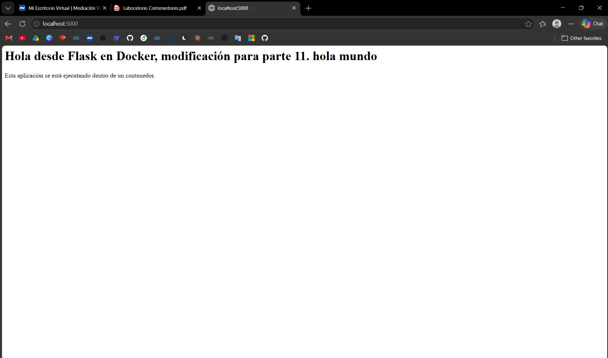

# Parte 10: Persistencia con volúmenes

## Qué se hizo

Se creó un volumen llamado `datos-lab`, se montó en un contenedor Ubuntu en la ruta `/datos` y se guardó un archivo dentro de él. Luego se eliminó ese contenedor, se creó un segundo contenedor con el mismo volumen y se verificó que el archivo seguía disponible. Al final se inspeccionó el volumen.

## Comandos ejecutados

| Comando | Para qué sirve |
|---|---|
| `docker volume create datos-lab` | Crea un volumen llamado `datos-lab`. |
| `docker volume ls` | Lista los volúmenes existentes. |
| `docker run -it --name contenedor-volumen -v datos-lab:/datos ubuntu bash` | Crea un contenedor Ubuntu interactivo y monta el volumen `datos-lab` en `/datos`. |
| `echo "..." > /datos/archivo.txt` / `cat /datos/archivo.txt` | Dentro del contenedor, crean y leen un archivo guardado en el volumen. |
| `docker rm contenedor-volumen` | Elimina el primer contenedor. |
| `docker run -it --name contenedor-volumen-2 -v datos-lab:/datos ubuntu bash` | Crea un segundo contenedor con el mismo volumen. |
| `docker rm contenedor-volumen-2` | Elimina el segundo contenedor. |
| `docker volume inspect datos-lab` | Muestra la información del volumen. |

## Resultado obtenido

### Creación y listado del volumen

```text
$ docker volume create datos-lab
datos-lab
$ docker volume ls
DRIVER    VOLUME NAME
local     datos-lab
```

### Primer contenedor: se crea el archivo

```text
$ docker run -it --name contenedor-volumen -v datos-lab:/datos ubuntu bash
root@b8bd98257ec3:/# echo "Este archivo está en un volumen" > /datos/archivo.txt
root@b8bd98257ec3:/# cat /datos/archivo.txt
Este archivo está en un volumen
root@b8bd98257ec3:/# exit
exit
$ docker rm contenedor-volumen
contenedor-volumen
```

### Segundo contenedor: el archivo sigue existiendo

```text
$ docker run -it --name contenedor-volumen-2 -v datos-lab:/datos ubuntu bash
root@198dfe60cd1f:/# cat /datos/archivo.txt
Este archivo está en un volumen
root@198dfe60cd1f:/# exit
exit
$ docker rm contenedor-volumen-2
contenedor-volumen-2
```

### Inspección del volumen

```text
$ docker volume inspect datos-lab
[
    {
        "CreatedAt": "2026-10-06T11:06:02-06:00",
        "Driver": "local",
        "Labels": null,
        "Mountpoint": "/var/lib/docker/volumes/datos-lab/_data",
        "Name": "datos-lab",
        "Options": null,
        "Scope": "local"
    }
]
```

## Qué es un volumen

Un volumen es un espacio de almacenamiento administrado por Docker que existe fuera del sistema de archivos del contenedor. Los datos guardados en un volumen se conservan aunque el contenedor que los usaba se elimine [1].

## Cómo se crea

Se crea con `docker volume create <nombre>` [2]. En esta práctica:

```bash
docker volume create datos-lab
```

Con `docker volume ls` se comprobó que el volumen quedó registrado con el driver `local`.

## Cómo se monta en un contenedor

Se monta con la opción `-v` (o `--volume`) de `docker run`, con el formato `-v NOMBRE_VOLUMEN:RUTA_EN_CONTENEDOR` [1], [3]. En esta práctica:

```bash
-v datos-lab:/datos
```

Esto hace que lo que el contenedor lea o escriba en `/datos` se guarde en el volumen `datos-lab`. Los archivos creados fuera de esa ruta siguen viviendo solo en la capa del contenedor.

## Qué pasó con el archivo después de eliminar el primer contenedor

El archivo `archivo.txt` **no se perdió**. Después de ejecutar `docker rm contenedor-volumen`, se creó `contenedor-volumen-2` (con otro ID, por lo que es un contenedor distinto) montando el mismo volumen, y `cat /datos/archivo.txt` mostró el mismo contenido: `Este archivo está en un volumen`. Esto se debe a que el archivo estaba guardado en el volumen y no en el contenedor, y eliminar un contenedor no elimina los volúmenes con nombre que usaba [1], [4].

## Resultado de `docker volume inspect`

| Campo | Valor | Significado |
|---|---|---|
| `Name` | `datos-lab` | Nombre del volumen. |
| `Driver` | `local` | El volumen se almacena en el mismo equipo donde corre Docker. |
| `Scope` | `local` | Solo es visible para este Docker Engine. |
| `Mountpoint` | `/var/lib/docker/volumes/datos-lab/_data` | Ruta en el host donde Docker guarda los datos del volumen. |
| `CreatedAt` | `2026-10-06T11:06:02-06:00` | Fecha y hora de creación. |
| `Labels` / `Options` | `null` | No se definieron etiquetas ni opciones adicionales. |

El comando se ejecutó después de eliminar ambos contenedores y el volumen seguía existiendo, lo que confirma que su ciclo de vida es independiente del de los contenedores [5].

## Observaciones

- **El volumen sobrevivió a los dos contenedores:** ambos se eliminaron con `docker rm` y `docker volume inspect` siguió mostrando `datos-lab`.
- **Los contenedores eran distintos:** los ID `b8bd98257ec3` y `198dfe60cd1f` son diferentes, y aun así el segundo pudo leer el archivo del primero.
- **Dónde se guardan los datos:** el `Mountpoint` está dentro del directorio que Docker administra en el host (`/var/lib/docker/volumes/`), por lo que normalmente no se accede a él directamente, sino mediante contenedores.
- **Caracteres especiales en la terminal:** en la terminal original el comando `echo` apareció con `\303\241` en lugar de `á`. Es solo cómo se mostró el carácter al copiar la sesión; el archivo se guardó bien, como lo confirma el `cat`. En la evidencia de arriba lo dejé con `á`.
- **Qué no se probó:** no se hizo una prueba de control sin volumen (para ver que el archivo sí se pierde al eliminar el contenedor), ni se eliminó el volumen con `docker volume rm`. El volumen `datos-lab` sigue existiendo en el equipo.

## Preguntas de reflexión

### 1. ¿Qué problema resuelven los volúmenes?

Por defecto, los datos que un contenedor escribe en su propio sistema de archivos se pierden cuando el contenedor se elimina, porque viven en su capa de escritura [1]. Los volúmenes resuelven esto guardando los datos fuera del ciclo de vida del contenedor, de modo que se conservan al eliminarlo o reemplazarlo. Esto se comprobó en el laboratorio: el archivo creado por `contenedor-volumen` pudo leerse desde `contenedor-volumen-2`.

### 2. ¿El volumen pertenece a un contenedor específico?

No. Un volumen es un objeto independiente que se crea y se administra por separado [2]. Puede montarse en un contenedor, en otro, o incluso en varios al mismo tiempo [1]. En esta práctica, el mismo volumen `datos-lab` fue usado por dos contenedores distintos, uno después del otro.

### 3. ¿Qué diferencia hay entre eliminar un contenedor y eliminar un volumen?

Eliminar un contenedor (`docker rm`) borra el contenedor y su capa de escritura, pero no borra los volúmenes con nombre que tenía montados [4]. Eliminar un volumen (`docker volume rm`) borra el volumen y todos los datos que contiene [5]. En el laboratorio solo se eliminaron contenedores, por eso los datos se conservaron. Para perder el archivo habría que eliminar el volumen `datos-lab`.

### 4. ¿Para qué casos reales se usarían volúmenes?

Se usan cuando los datos deben conservarse más allá de la vida de un contenedor, por ejemplo:

- **Bases de datos:** guardar los datos de MySQL o PostgreSQL para no perderlos al actualizar o recrear el contenedor.
- **Archivos subidos por usuarios** en una aplicación web.
- **Registros (logs)** que se quieren conservar para revisarlos después.
- **Compartir datos entre contenedores** que trabajan sobre la misma información.

## Reflexión personal

Con esta práctica entendí que un contenedor es desechable: se puede eliminar y volver a crear sin problema, pero si guarda datos importantes dentro de sí mismo, esos datos se van con él. Ver que un contenedor completamente nuevo leyó el archivo del anterior me dejó claro que los datos viven en el volumen y no en el contenedor. También me pareció útil que el volumen sea un objeto aparte que hay que eliminar de forma explícita, lo cual protege los datos de borrados accidentales de contenedores, pero también implica que hay que limpiarlo manualmente cuando ya no se necesite.

## Bind mounts

### Qué se hizo

Se ejecutó la imagen `laboratorio-flask:1.0` montando la carpeta local `app/` dentro del contenedor en `/app` mediante un bind mount. Se abrió la aplicación en el navegador, se modificó el mensaje HTML de `app.py` en la máquina host y se eliminó el contenedor. Luego se volvió a ejecutar con el mismo bind mount para comprobar que el cambio se reflejaba sin reconstruir la imagen.

### Comandos ejecutados

| Comando | Para qué sirve |
|---|---|
| `docker run --name app-bind -p 5000:5000 -v "$(pwd)":/app laboratorio-flask:1.0` | Crea e inicia un contenedor, publica el puerto 5000 y monta la carpeta actual del host en `/app`. |
| `code app.py` | Abre `app.py` en el host para modificar el mensaje de la página principal. |
| `docker stop app-bind` / `docker rm app-bind` | Detienen y eliminan el primer contenedor. |
| `docker run --name app-bind-2 -p 5000:5000 -v "$(pwd)":/app laboratorio-flask:1.0` | Crea un segundo contenedor con el mismo bind mount. |
| `docker stop app-bind-2` / `docker rm app-bind-2` | Detienen y eliminan el segundo contenedor. |

### Resultado obtenido

#### Primer contenedor: `app-bind`

```text
$ cd app/
$ ls
Dockerfile  app.py  requirements.txt
$ docker run --name app-bind -p 5000:5000 -v "$(pwd)":/app laboratorio-flask:1.0
 * Serving Flask app 'app'
 * Debug mode: off
WARNING: This is a development server. Do not use it in a production deployment. Use a production WSGI server instead.
 * Running on all addresses (0.0.0.0)
 * Running on http://127.0.0.1:5000
 * Running on http://172.17.0.2:5000
Press CTRL+C to quit
172.17.0.1 - - [06/Oct/2026 17:13:10] "GET / HTTP/1.1" 200 -
172.17.0.1 - - [06/Oct/2026 17:15:54] "GET / HTTP/1.1" 200 -
```

Se abrió `http://localhost:5000` y la aplicación mostró el mensaje por defecto, ya que no se definió la variable `MENSAJE`. El registro muestra dos solicitudes `GET /` con código `200`: la primera a las 17:13:10 y la segunda a las 17:15:54.

#### Modificación de `app.py` en el host

Con `app-bind` todavía en ejecución, se abrió `app.py` desde la máquina host y se cambió el mensaje HTML de la página principal:

```text
$ code app.py
```

- Antes: `Hola desde Flask en Docker`
- Después: `[MENSAJE NUEVO]`

No se modificó el `Dockerfile` ni se reconstruyó la imagen.

Después, desde otra terminal, se detuvo y eliminó el contenedor:

```text
$ docker stop app-bind
app-bind
$ docker rm app-bind
app-bind
```

#### Segundo contenedor: `app-bind-2`

```text
$ docker run --name app-bind-2 -p 5000:5000 -v "$(pwd)":/app laboratorio-flask:1.0
 * Serving Flask app 'app'
 * Debug mode: off
WARNING: This is a development server. Do not use it in a production deployment. Use a production WSGI server instead.
 * Running on all addresses (0.0.0.0)
 * Running on http://127.0.0.1:5000
 * Running on http://172.17.0.2:5000
Press CTRL+C to quit
172.17.0.1 - - [06/Oct/2026 17:16:36] "GET / HTTP/1.1" 200 -
```

Al abrir nuevamente `http://localhost:5000`, la aplicación mostró el mensaje modificado. El registro confirma la solicitud `GET /` con código `200` a las 17:16:36.

```text
$ docker stop app-bind-2
app-bind-2
$ docker rm app-bind-2
app-bind-2
```

**Captura del navegador (`http://localhost:5000`) con el mensaje modificado:**



### Diferencia entre `datos-lab:/datos` y `"$(pwd)":/app`

| | `datos-lab:/datos` | `"$(pwd)":/app` |
|---|---|---|
| Tipo | Volumen administrado por Docker | Bind mount |
| Origen | Nombre de un volumen (`datos-lab`) | Ruta absoluta de una carpeta del host (resultado de `$(pwd)`) |
| Dónde están los datos | En el directorio que administra Docker (`/var/lib/docker/volumes/datos-lab/_data`) | En la carpeta elegida del host (aquí, `app/`) |
| Quién lo administra | Docker (`docker volume create`, `ls`, `inspect`) | El usuario, con el sistema de archivos del host |
| Uso en esta práctica | Guardar un archivo que sobrevive a los contenedores | Usar el código local dentro del contenedor |

Docker distingue ambos casos por el primer elemento de `-v`: un nombre simple se interpreta como volumen y una ruta como bind mount [1], [3], [6]. Además, el bind mount se monta sobre `/app`, por lo que el contenido de esa carpeta en el contenedor pasa a ser el de la carpeta del host y no el que se copió a la imagen al construirla [6].

### Qué ocurrió al modificar el código local

Al editar `app.py` en el host, el cambio quedó disponible dentro del contenedor, porque `/app` es la misma carpeta del host y no una copia. Al ejecutar `app-bind-2`, la aplicación mostró el mensaje nuevo sin haber reconstruido `laboratorio-flask:1.0`. Esto comprueba que el código que se ejecutó vino de la carpeta local y no de la imagen.

El contenedor `app-bind` recibió una segunda solicitud (17:15:54) después de la primera. El cambio sí se vio con certeza al iniciar `app-bind-2`.

### Por qué esto puede ser útil durante el desarrollo

Permite probar cambios de código sin reconstruir la imagen cada vez: se edita el archivo en el editor habitual del host y se vuelve a ejecutar el contenedor [6]. Esto acelera el ciclo de desarrollo, porque ejecutar `docker build` después de cada cambio sería más lento.

### Observaciones

- **La imagen no cambió:** `laboratorio-flask:1.0` fue la misma en ambas ejecuciones; lo único que cambió fue el contenido de la carpeta montada.
- **El cambio vive en el host:** el archivo modificado sigue en la carpeta local aunque se eliminen los contenedores, a diferencia de lo que se escribe en la capa de escritura de un contenedor.
- **El bind mount reemplaza lo que había en `/app`:** dentro del contenedor se ve la carpeta del host, no los archivos copiados en la imagen.
- **Mismo puerto en ambos contenedores:** ambos usaron `-p 5000:5000`. Esto fue posible porque el primero se eliminó antes de iniciar el segundo.
- **Terminal reordenada:** en la sesión original, la salida de `app-bind` apareció después de la de `app-bind-2` porque el contenedor corría en primer plano en una terminal y los comandos `stop` y `rm` se ejecutaron desde otra. Arriba los dejé en orden cronológico. También omití un `docker run` de `app-env-2` que corresponde a la parte de variables de entorno.
- **Sintaxis según el sistema:** `"$(pwd)"` funciona en Linux y macOS. En PowerShell se usa `${PWD}`. Esta práctica se hizo en Linux, por lo que se usó `"$(pwd)"`.
- **Qué no se probó:** no se montó la carpeta en modo solo lectura (`:ro`), no se comprobó el comportamiento con el modo debug de Flask activado y solo se tomó una captura, por lo que no hay evidencia visual del mensaje original.

### Preguntas de reflexión

#### 1. ¿Qué diferencia hay entre un volumen y un bind mount?

Un volumen es almacenamiento creado y administrado por Docker, identificado por un nombre y guardado en un directorio propio de Docker en el host [1]. Un bind mount enlaza una carpeta o archivo específico del host con una ruta del contenedor y depende de que esa ruta exista en el host [6]. En el laboratorio, `datos-lab:/datos` es un volumen y `"$(pwd)":/app` es un bind mount.

#### 2. ¿Cuál parece más conveniente para desarrollo?

El bind mount, porque el código se edita en el host y el contenedor lo ve directamente, sin reconstruir la imagen. Esto se comprobó al cambiar el mensaje de `app.py` y verlo reflejado al iniciar `app-bind-2`.

#### 3. ¿Cuál parece más conveniente para datos persistentes de una aplicación?

El volumen. Docker lo administra, no depende de la estructura de carpetas del host y es el mecanismo recomendado para persistir datos generados por contenedores [1]. Además, se puede listar e inspeccionar con comandos de Docker, como se hizo con `docker volume ls` y `docker volume inspect`.

#### 4. ¿Qué riesgos podría tener montar carpetas del host dentro del contenedor?

- **Modificación o borrado de archivos del host:** por defecto el montaje es de lectura y escritura, así que un proceso dentro del contenedor puede alterar los archivos montados [6].
- **Exposición de información:** montar una carpeta con datos sensibles (claves, configuraciones, documentos) los deja accesibles al contenedor.
- **Dependencia del host:** el contenedor deja de ser autocontenido, porque requiere que la ruta exista y tenga el contenido esperado.
- **Problemas de permisos:** los archivos creados desde el contenedor pueden quedar con un propietario distinto en el host (por ejemplo, `root`).

Una forma de reducir el riesgo es montar solo la carpeta necesaria y, si el contenedor no debe escribir, usar el modo de solo lectura [6].

### Reflexión personal

Con esta parte entendí que un bind mount cambia de dónde sale el código que ejecuta el contenedor: ya no es el de la imagen, sino el de mi carpeta local. Poder editar `app.py` y ver el cambio sin reconstruir la imagen me pareció muy útil para desarrollar. También vi que no es lo mismo que un volumen: el bind mount me da control directo sobre los archivos, pero a cambio el contenedor depende de mi máquina y puede modificar mis archivos. Por eso lo vería como una herramienta de desarrollo, y los volúmenes como la opción para los datos que una aplicación debe conservar.

## Referencias

[1] Docker Inc., "Volumes," *Docker Docs*. [En línea]. Disponible en: https://docs.docker.com/engine/storage/volumes/. [Accedido: 6-oct-2026].

[2] Docker Inc., "docker volume create," *Docker Docs*. [En línea]. Disponible en: https://docs.docker.com/reference/cli/docker/volume/create/. [Accedido: 6-oct-2026].

[3] Docker Inc., "docker container run," *Docker Docs*. [En línea]. Disponible en: https://docs.docker.com/reference/cli/docker/container/run/. [Accedido: 6-oct-2026].

[4] Docker Inc., "docker container rm," *Docker Docs*. [En línea]. Disponible en: https://docs.docker.com/reference/cli/docker/container/rm/. [Accedido: 6-oct-2026].

[5] Docker Inc., "docker volume inspect," *Docker Docs*. [En línea]. Disponible en: https://docs.docker.com/reference/cli/docker/volume/inspect/. [Accedido: 6-oct-2026].

[6] Docker Inc., "Bind mounts," *Docker Docs*. [En línea]. Disponible en: https://docs.docker.com/engine/storage/bind-mounts/. [Accedido: 6-oct-2026].
